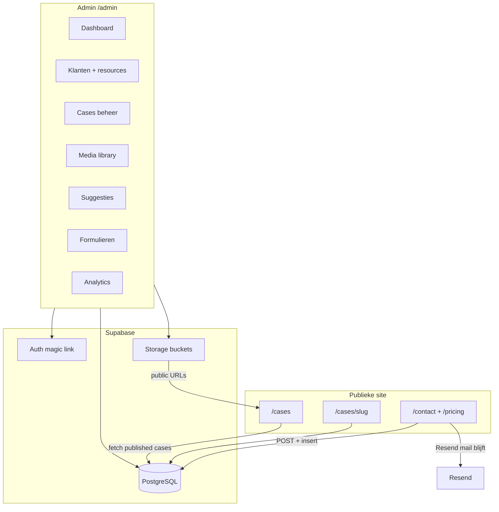

# IKR Admin Panel — implementatieplan

> **Status:** nog niet gebouwd — plan voor later. Backend = Supabase. Auth = magic link + email whitelist.

## Context

De site in `IKR website/` is nu puur statisch: cases staan hardcoded in `src/data/cases.ts`, formulieren gaan alleen via Resend-mail (`/api/contact`, `/api/pricing/request`) zonder opslag. Er is geen auth, geen uploads, geen admin.

**Beslissing (nog te loggen in `decisions.md` → Algemeen):** Supabase als backend voor admin — DB, Auth (email whitelist), Storage. Payload blijft weg; dit is een lichte custom admin, geen CMS.

**Auth-keuze:** magic link via Supabase Auth, alleen whitelisted e-mailadressen.

---

## Architectuur



---

## Database schema (Supabase migrations)

| Tabel | Doel | Belangrijkste velden |
|-------|------|----------------------|
| `admin_users` | Whitelist | `email`, `name`, `active` |
| `clients` | Klanten (Wasbar, Ohma, …) | `name`, `slug`, `logo_url`, `status`, `notes` |
| `client_resources` | Assets per klant | `client_id`, `file_id`, `type` (video/image/logo/doc) |
| `media_files` | Team media library | `storage_path`, `filename`, `mime_type`, `size`, `uploaded_by`, `client_id?`, `tags[]` |
| `cases` | Portfolio items | `client_id`, `slug`, `title`, `hero_video_url`, `logo_url`, `testimonial_*`, `published`, `sort_order` |
| `suggestions` | Website feedback | `title`, `description`, `page_url`, `status`, `created_by` |
| `form_submissions` | Opgeslagen leads | `type` (contact/pricing), `payload` (jsonb), `read`, `status` (new/contacted/converted/lost) |

**RLS:** publiek mag alleen `cases` lezen waar `published = true`. Alle writes + overige tabellen alleen voor ingelogde admin met email in whitelist. Storage bucket `ikr-media`: authenticated upload, public read voor gepubliceerde assets.

**Client → Case flow:** klant aanmaken → resources uploaden (logo, video's) → "Maak case" knop pre-fillt case-formulier met klant + gekozen resources → publish zet case live op `/cases`.

---

## Admin UI — secties

Route: **`/admin`** (layout zonder publieke navbar/footer; functioneel dashboard in IKR-kleuren).

| Sectie | Wat je vroeg | Implementatie |
|--------|--------------|---------------|
| **Dashboard** | Overzicht + analytics | KPI-cards: nieuwe leads (7d), open suggesties, actieve klanten, gepubliceerde cases. Analytics-widget (zie onder). |
| **Klanten** | Klanten + resources | Tabel + detail: naam, status, gekoppelde files, knop "Nieuwe case". |
| **Cases** | Cases toevoegen | CRUD-form: koppel klant, kies hero-video + logo uit media, testimonial, publish/draft, sort order. Preview link. |
| **Media** | Team uploads | Drag-and-drop upload (video/image/pdf), filter op type/klant, optioneel taggen. Max file size via Supabase config (~100MB voor video). |
| **Suggesties** | Website fixes droppen | Snel formulier: titel, beschrijving, optioneel pagina-URL. Status: open → in progress → done. |
| **Formulieren** | Laatste inzendingen | Lijst contact + pricing submissions, markeer gelezen, status pipeline. Resend-mail blijft parallel lopen. |
| **Analytics** | Bezoekers | `@vercel/analytics` + `@vercel/speed-insights` op publieke layout; dashboard toont pageviews (Vercel dashboard embed/link of simpele custom counter via middleware — fase 2 als Vercel nog niet live). |

### Extra secties (aanbevolen)

1. **Lead pipeline** — status op formulieren (new/contacted/converted/lost) zodat niets in de inbox verdwijnt.
2. **Testimonials beheer** — testimonials staan nu fake/hardcoded in `CasesPageContent.tsx`; verplaats naar DB, koppel optioneel aan case/klant.
3. **Publish/draft** — cases pas zichtbaar op site na expliciete publish (voorkomt half-af werk live).
4. **Activiteitlog** — simpele `activity_log` tabel (wie uploadte wat, wanneer case gepubliceerd) — handig met meerdere teamleden.
5. **Zoek/filter** — globale zoekbalk in admin op klantnaam, bestandsnaam, lead-email.

---

## Publieke site — aanpassingen

1. **Cases dynamisch maken** — `CasesPageContent.tsx` en homepage `CasesSection.tsx` fetchen published cases uit Supabase (Server Component + `revalidatePath` na admin-mutatie, of ISR 60s).
2. **Detailpagina's** — nieuwe route `/cases/[slug]/page.tsx`. Data uit `cases` + gekoppelde `client`.
3. **Play-knoppen** — linken naar detailpagina (nu `pointerEvents: 'none'`).
4. **Migratie** — seed script migreert huidige 4 cases uit `cases.ts` naar Supabase; daarna fallback verwijderen.
5. **Form API's uitbreiden** — na succesvolle Resend-send ook `insert` in `form_submissions` (non-blocking: mail faalt niet als DB insert faalt, maar log wel).

---

## Tech stack toevoegingen

```bash
npm install @supabase/supabase-js @supabase/ssr
# optioneel admin UI: shadcn/ui voor snelle forms/tables
npm install @vercel/analytics  # na Vercel deploy
```

Nieuwe bestanden (indicatief):

- `src/lib/supabase/client.ts` — browser client
- `src/lib/supabase/server.ts` — server + cookies
- `src/lib/supabase/middleware.ts` — session refresh
- `src/middleware.ts` — protect `/admin/*`
- `src/app/admin/` — layout + pagina's per sectie
- `src/app/api/admin/` — upload, revalidate, etc.
- `supabase/migrations/` — schema + RLS

Env vars (uitbreiden `.env.example`):

```
NEXT_PUBLIC_SUPABASE_URL=
NEXT_PUBLIC_SUPABASE_ANON_KEY=
SUPABASE_SERVICE_ROLE_KEY=   # alleen server-side voor whitelist-check + admin writes
ADMIN_EMAILS=casper@...,team@...   # bootstrap whitelist
```

---

## Fasering

### Fase 1 — Fundament (eerst doen)
- [ ] Supabase project aanmaken
- [ ] Schema + RLS + storage bucket
- [ ] Auth magic link + middleware op `/admin`
- [ ] Admin shell (login + sidebar + lege secties)
- [ ] Whitelist bootstrap uit `ADMIN_EMAILS`

### Fase 2 — Klanten, media, cases
- [ ] Media upload + library UI
- [ ] Klanten CRUD + resource-koppeling
- [ ] Cases CRUD + "publish naar site"
- [ ] Publieke `/cases` + `/cases/[slug]` op DB
- [ ] Seed huidige 4 cases

### Fase 3 — Operatie
- [ ] Form submissions opslaan + admin lijst + lead status
- [ ] Suggesties CRUD
- [ ] Dashboard KPI's
- [ ] Testimonials uit DB

### Fase 4 — Analytics + polish
- [ ] Vercel Analytics na deploy
- [ ] Activiteitlog
- [ ] Zoek/filter
- [ ] OG-images per case (optioneel)

---

## Wat jij moet doen (niet door agent)

1. Supabase project aanmaken op [supabase.com](https://supabase.com) (free tier volstaat voor start).
2. Whitelist e-mails doorgeven (jij + team).
3. Na Fase 4: Vercel deploy + Analytics enablen.

---

## Risico's

- **Video's groot** — Supabase free tier = 1GB storage; grote TikTok-clips snel vol. Overweeg later Cloudflare R2 of alleen gecomprimeerde previews in Supabase, originals extern.
- **Supabase MCP timeout** — bij implementatie handmatig migrations draaien als MCP faalt.
- **Resend blijft primair** — DB is backup/admin view; als insert faalt, mail komt nog binnen.

---

## Scope buiten dit plan

- Geen publieke login / klantportaal
- Geen Notion-sync
- Geen volledig CMS voor homepage-secties (suggesties-vak dekt dat deels)
